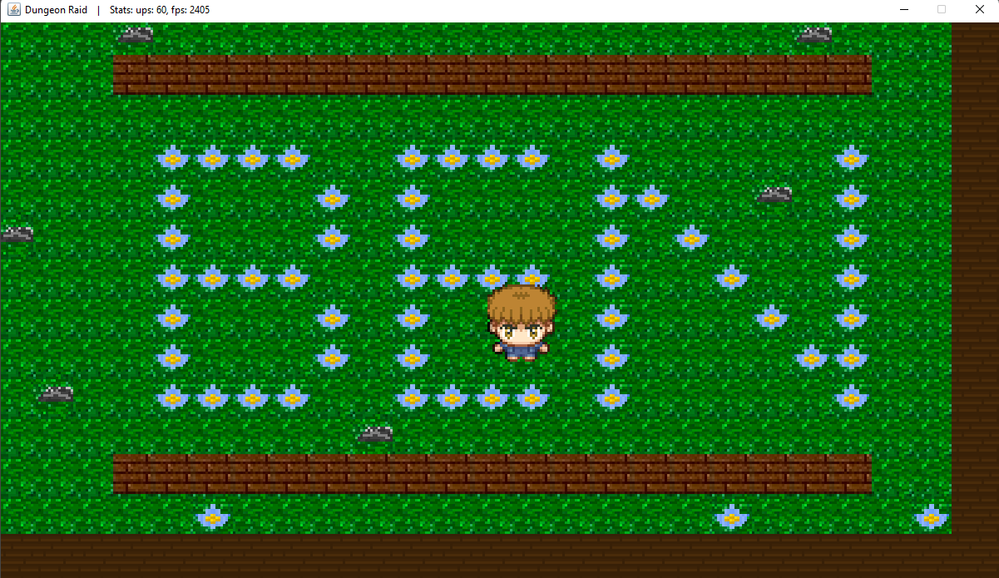

# DungeonRaid
### Hi, 
#### This is my first take on guided game development in Java, while implementing my own twists as i expand my knowledge and understanding.
#### The game is a work in progress - meant to sharpen my skills in java, and learn new things along the way.
#### My code is filled with comments, which contributes for my own understanding - and hopfuly others; nevertheless i have made a 'comments' package for things that require more comprehensive explanations on change i'v made in my code.
<h3 align="center">Here are some screenshots from the game:<h3/>

  

<h4> Thank you for visiting my work, 
Ben Daniels.<h4/>
